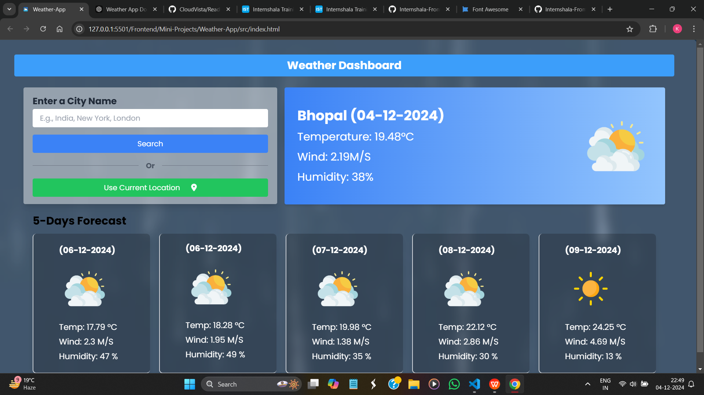
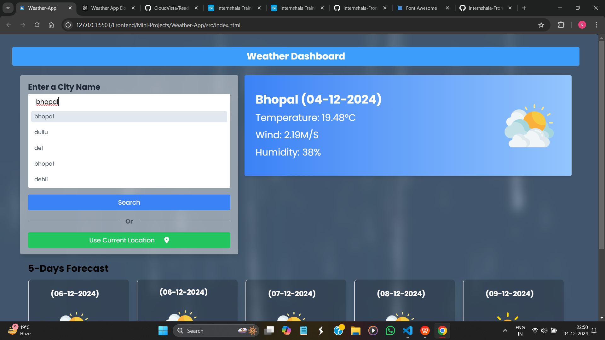

# **Weather Forecast Application**

## **Description**
The Weather Forecast Application is a web app that provides real-time weather information for any city worldwide. Key features include:
- Current weather display with temperature, wind speed, and humidity.
- A five-day forecast for planning ahead.
- Recent search history for quick access.
- Geolocation support to fetch weather data based on your location.

---

## **Features**
1. **City Search**: Enter a city name to fetch weather and forecast data.
2. **Geolocation Support**: Use current location for real-time weather updates.
3. **Five-Day Forecast**: Displays weather trends for the next five days.
4. **Recent Searches**: Dropdown menu to view previously searched cities.
5. **Error Handling**: Displays errors for invalid inputs or API issues.

---

## **Technologies Used**
- **HTML5**: Structure and layout.
- **Tailwind CSS**: Styling and responsiveness.
- **JavaScript (ES6)**: Functionality and dynamic features.
- **OpenWeather API**: For real-time weather data.

---

## **Setup Instructions**

### **1. Clone the Repository**
Clone the project to your local machine using Git:

```vscode
git clone https://github.com/SandyBhai03/Internshala-Frontend/tree/main/Mini-Projects/Weather-App

2.   Open the project folder:
bash
Copy code
cd Weather-App 

3. Open index.html in your browser to view the app.

# Usage:
1. Search for a city to get real-time weather updates.
2. The app will display the current temperature, humidity, wind speed, and an icon representing the current weather.






